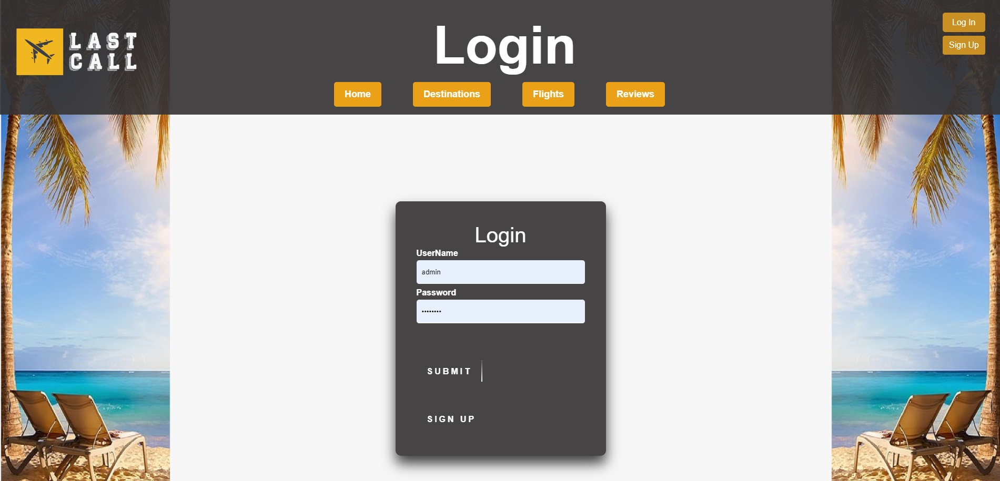
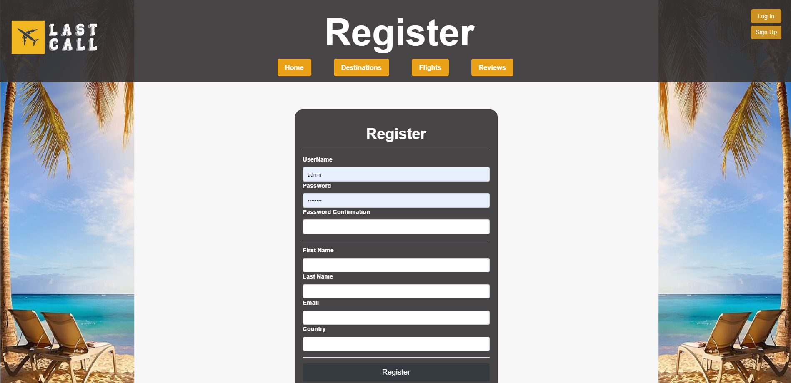
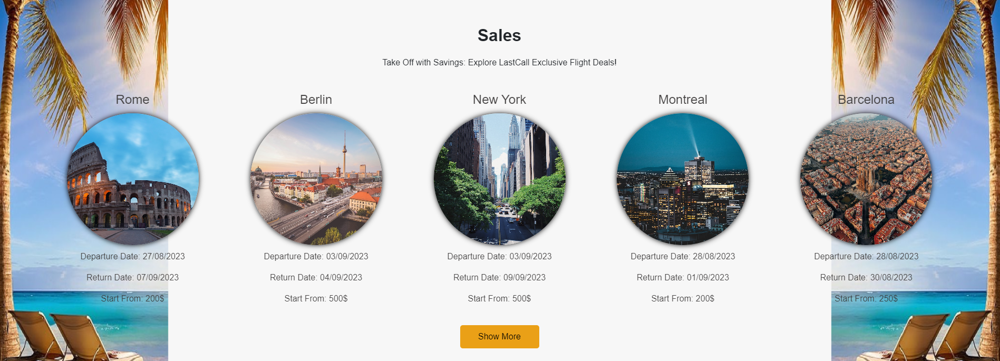
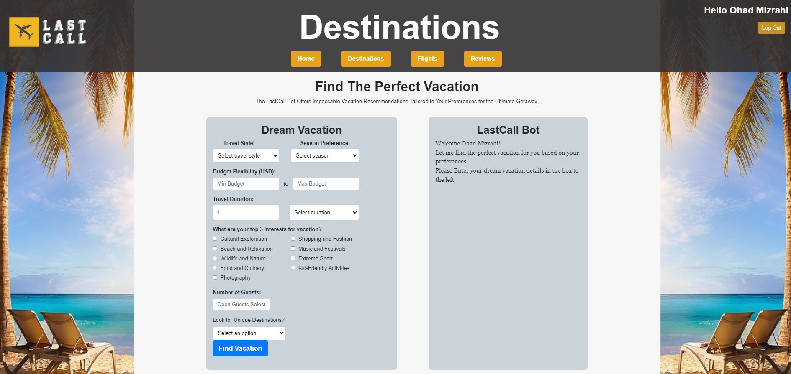
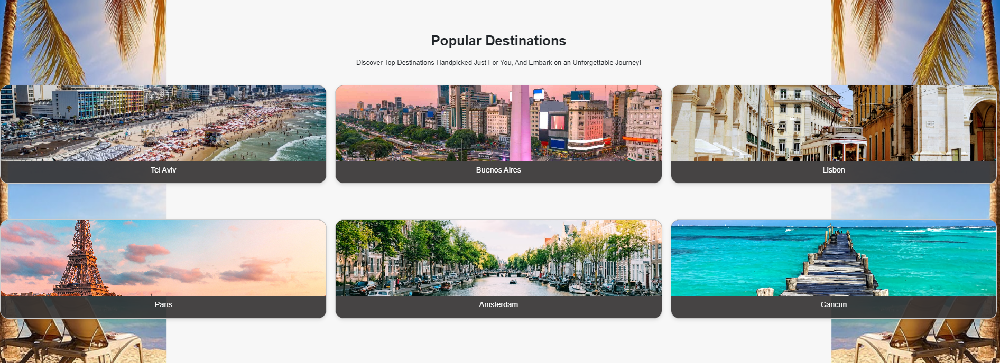
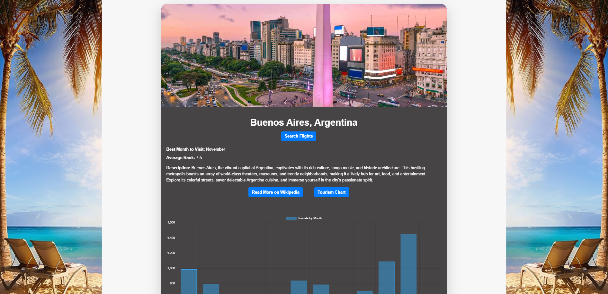
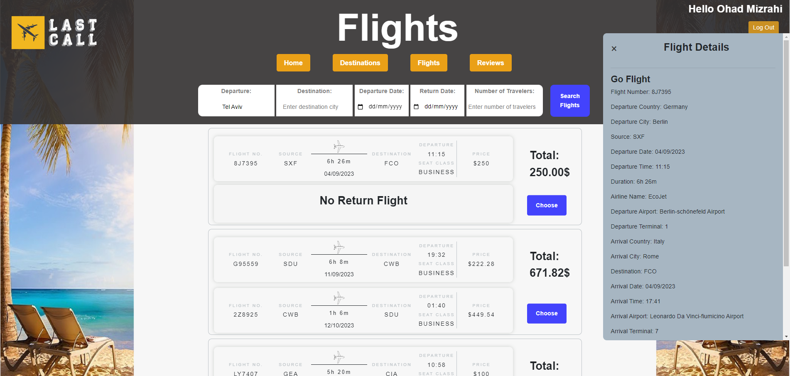
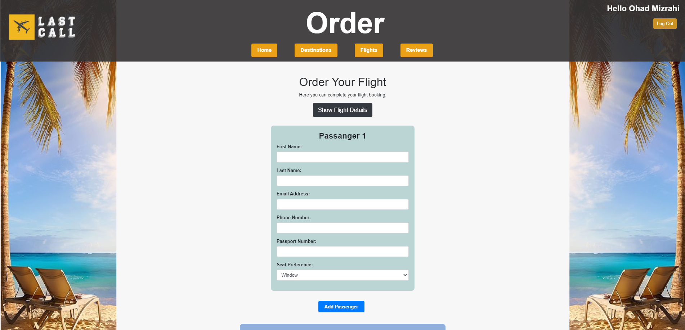
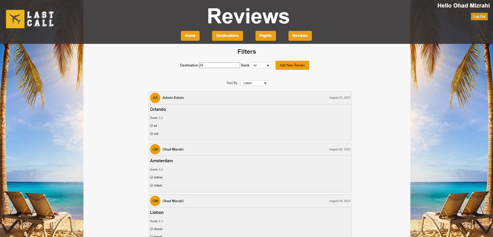
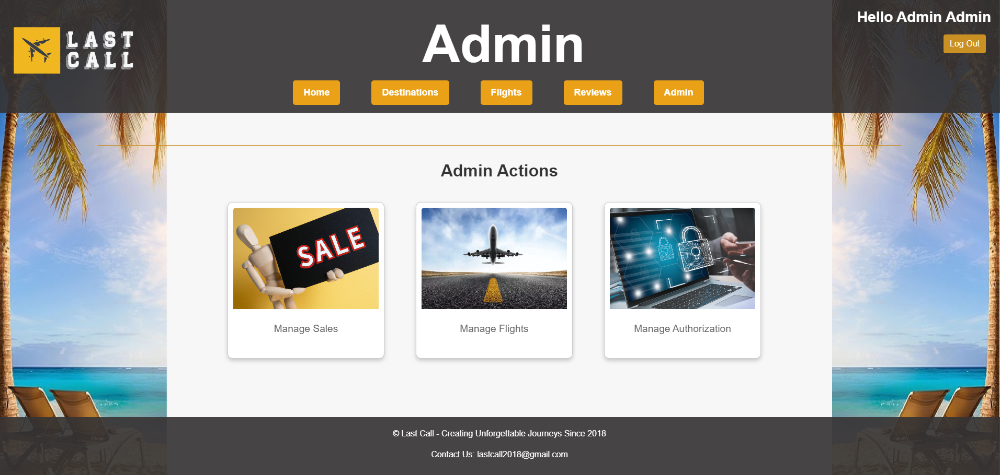

# LastCall Flight Search & Recommendation Web Platform
This Project is an Educational project and not fit for Real Flights Order

## Getting Strated
The follow url is inactive right now - in order to getting started you need to clone and run the server
https://lastcallflight-be3b52825517.herokuapp.com/

## Overview

Our flight search website offers users a comprehensive solution for their travel needs, leveraging an advanced bot. Users can search for flights, read and write reviews, and gain insights into popular destinations. With a bot in place, our platform matches appropriate flights with each vacation, ensuring a seamless travel experience for all.

## Main Technologies
**Backend Related Technologies:**  
Atlas MonoDB server, Mongoose connector, JavaScript, Node.js, Express.js.  
**Frontend Related Technologies:**  
HTML5, EJS view-engine, CSS, Bootstrap, jQuery, Fetch.  
**Third Party Services:**  
OpenAI chatGPT, Gmail SMTP, unsplash  
**Flight Generator**  
The Website displays fake flights created by a tool we created named flight generator.  
This tool (under services folder) is based on faker lib.  

## Users

**Admin:** System managers with extra capabilities.  
**Travelers:** All kinds of travelers for all purposes.  
**Suppliers:** Users allowed to supply new flights - inactive feature and user.  

## Key Features & Processes

**Flight Search:** Allows users to find flights based on destinations, dates, and preferences.  
**Reviews:** Users can share their flight experiences or read others' reviews to make informed decisions.  
**Popular Destinations:** Showcases popular destinations, ensuring users are always in the loop with trending travel spots.  
**LastCall Recommendor:** Our Bot that matches users with the most appropriate flights based on their vacation needs and preferences.  
**Sales Flights:**  
**Inforamtive Descriptive Platform for Destinations:**  
**Admin Capabilities:** Add sales, delete sales, manage users and adding new flights.    

## Architecture & Design

The platform employs an n-tier architecture, ensuring separation of concerns, modularity, and scalability:

**Presentation Layer:** Handles the UI and user interactions - EJS, jQuery, Bootstrap.  
**Business Logic Layer:** Contains the business logic, rules and Controling the business flow - Node.js & Express.   
**Data Layer:** Houses databases and other sources of data - Mongoose.    
**External Services:** Leverage ChatGPT, Email SMTP and Other APIs.  

Along with the n-tier architecture, we've adopted the MVC (Model-View-Controller) pattern:

**Model:** Represents the data structures and the business logic.  
**View:** Displays the data and UI.  
**Controller:** Handles user input.  

## Database Structure

MongoDB is our chosen NoSQL database system, renowned for its flexibility and scalability.  

### Our data is structured in collections:

**Flights Collection:** Contains flight data.  
**Users Collection:** Stores user profiles.  
**Reviews Collection:** Houses user reviews.  
**Destinations Collection:** Details on popular destinations.  
**Sales Collection:** All active sales and their details.  
**Airports Collection:** Contain larg amount of Airports worldwide.  

## Platform Screens

### Landing Page:

### Login:

### Register:

### Home Page:

### Sales Bar:

### Destinations Page:

### Destination Card:

### Flights Page:

### Order Flight Page:

### Reviews Page:

### Admin Page:

## Thank You For Review Our Project

### &copy; Ohad Mizrahi & Or Solomon 

