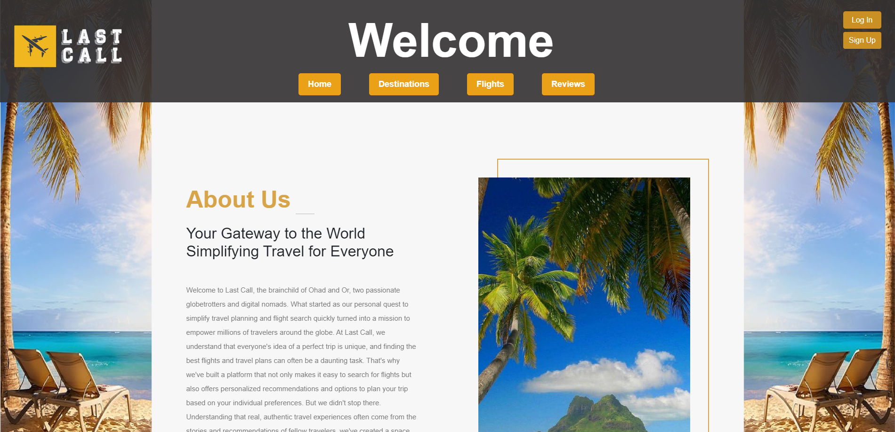

# LastCall Flight Search & Recommendation Web Platform
This Project is an Educational project and not fit for Production

## Overview

Our flight search website offers users a comprehensive solution for their travel needs, leveraging an advanced bot. Users can search for flights, read and write reviews, and gain insights into popular destinations. With a bot in place, our platform matches appropriate flights with each vacation, ensuring a seamless travel experience for all.

## Purpose

In today's vast travel landscape, travelers often find themselves overwhelmed with choices and information.  This platform serves as a one-stop solution, helping users navigate the world of air travel with ease. By not only providing flight search functionalities but also insights, reviews, and predictions, we aim to redefine the travel planning experience.

## Users

**Admin:** System managers with extra capabilities.  
**Travelers:** All kinds of travelers for all purposes.  
**Suppliers:** Users allowed to supply new flights - inactive feature and user.  

## Key Features & Processes

**Flight Search:** Allows users to find flights based on destinations, dates, and preferences.  
**Reviews:** Users can share their flight experiences or read others' reviews to make informed decisions.  
**Popular Destinations:** Showcases popular destinations, ensuring users are always in the loop with trending travel spots.  
**LastCall Recommendor:** Our Bot that matches users with the most appropriate flights based on their vacation needs and preferences.  
**Sales Flights:**  
**Inforamtive Descriptive Platform for Destinations:**  
**Admin Capabilities:** Add sales, delete sales, manage users and adding new flights.    

## Architecture & Design

The platform employs an n-tier architecture, ensuring separation of concerns, modularity, and scalability:

**Presentation Layer:** Handles the UI and user interactions.  
**Business Logic Layer:** Contains the business logic, rules and Controling the business flow.  
**Data Layer:** Houses databases and other sources of data.  
**External Services:** Leverage ChatGPT, Email SMTP and Other APIs.  

Along with the n-tier architecture, we've adopted the MVC (Model-View-Controller) pattern:

**Model:** Represents the data structures and the business logic.  
**View:** Displays the data and UI.  
**Controller:** Handles user input.  

## Database Structure

MongoDB is our chosen NoSQL database system, renowned for its flexibility and scalability.  

### Our data is structured in collections:

**Flights Collection:** Contains flight data.  
**Users Collection:** Stores user profiles.  
**Reviews Collection:** Houses user reviews.  
**Destinations Collection:** Details on popular destinations.  
**Sales Collection:** All active sales and their details.  
**Airports Collection:** Contain larg amount of Airports worldwide.  

## Getting Strated

1. clone the repo
2. run npm start in terminal

## Platform Screens

### Landing Page:

